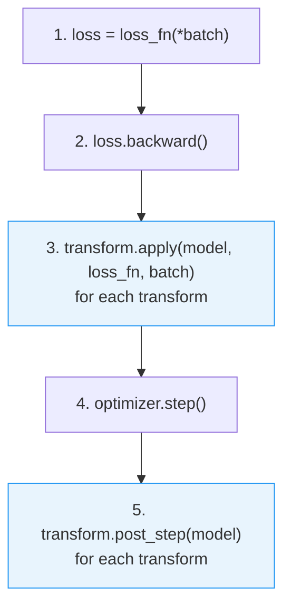

# samgria

Composable gradient transforms for PyTorch -- SAM, ASAM, LAMP, and beyond.

## Overview

samgria provides a protocol-based pipeline for gradient transform composition in PyTorch. Each transform hooks into two phases of the training step -- **pre-descent** (modify gradients or perturb parameters) and **post-descent** (operate on updated parameters) -- and transforms compose by stacking in a list. No custom optimiser wrappers, no monkey-patching.

Included transforms:

| Transform | Phase | Description |
|---|---|---|
| `SAM` | pre-descent | Sharpness-Aware Minimisation -- perturb in gradient direction, recompute grad at worst-case point |
| `ASAM` | pre-descent | Adaptive SAM -- perturbation scaled by parameter magnitude for scale-invariant sharpness |
| `LAMPRollback` | post-descent | Local-Averaging over Multiple Perturbations -- inject noise, accumulate moving average, periodic rollback |

## Installation

```bash
pip install git+https://github.com/DarkbyteAT/samgria.git
```

Requires Python 3.11+ and PyTorch 2.0+.

## Quick Start

```python
import torch
import torch.nn as nn
from samgria import SAM

model = nn.Linear(8, 2)
optimizer = torch.optim.Adam(model.parameters(), lr=1e-3)
sam = SAM(rho=0.05)

def loss_fn(x, y):
    return nn.functional.cross_entropy(model(x), y)

x = torch.randn(32, 8)
y = torch.randint(0, 2, (32,))

# 1. Forward
loss = loss_fn(x, y)

# 2. Backward
loss.backward()

# 3. Pre-descent transforms
sam.apply(model, loss_fn, (x, y))

# 4. Gradient descent
optimizer.step()
optimizer.zero_grad()

# 5. Post-descent transforms (no-op for SAM)
sam.post_step(model)
```

## Pipeline Execution Order

Every training step follows the same five-stage pipeline. Transforms hook into stages 3 and 5.



SAM and ASAM do their work in stage 3 (perturb, recompute, restore). LAMPRollback does its work in stage 5 (inject noise, accumulate, rollback). No-op methods are provided for unused phases so every transform is safe to call at both hooks.

## Transforms

### SAM

Sharpness-Aware Minimisation. Perturbs parameters in the normalised gradient direction by `rho`, recomputes the loss and gradient at the perturbed point, then restores the original parameters with the new gradient. The optimiser then descends using gradients from the worst-case neighbourhood.

```python
from samgria import SAM

sam = SAM(rho=0.05)  # rho: perturbation radius (default 1e-2)
```

**Reference:** Foret et al., "Sharpness-Aware Minimization for Efficiently Improving Generalization" (ICLR 2021).

### ASAM

Adaptive SAM. The perturbation direction is scaled by the squared absolute parameter values before normalisation, making the sharpness measure invariant to parameter rescaling. Larger parameters receive proportionally larger perturbations.

```python
from samgria import ASAM

asam = ASAM(rho=0.05)  # rho: perturbation radius (default 1e-2)
```

**Reference:** Kwon et al., "ASAM: Adaptive Sharpness-Aware Minimization for Scale-Invariant Learning of Deep Neural Networks" (ICML 2021).

### LAMPRollback

Local-Averaging over Multiple Perturbations. After each gradient descent step, injects uniform noise scaled by parameter magnitude and accumulates a moving average. After `rollback_len + 1` steps, replaces parameters with the moving average and resets.

```python
from samgria import LAMPRollback

lamp = LAMPRollback(
    eps=5e-3,        # noise scale (default 5e-3)
    rollback_len=10, # steps between rollbacks (default 10)
)
```

## Composable Pipeline

Transforms compose by iteration -- list them in order and call both hooks on each. Pre-descent transforms run before the optimiser step; post-descent transforms run after.

```python
import torch
import torch.nn as nn
from samgria import SAM, LAMPRollback

model = nn.Sequential(nn.Linear(8, 32), nn.ReLU(), nn.Linear(32, 2))
optimizer = torch.optim.SGD(model.parameters(), lr=1e-2)

transforms = [SAM(rho=0.05), LAMPRollback(eps=5e-3, rollback_len=10)]

def loss_fn(x, y):
    return nn.functional.cross_entropy(model(x), y)

for epoch in range(100):
    x = torch.randn(64, 8)
    y = torch.randint(0, 2, (64,))

    # Forward + backward
    loss = loss_fn(x, y)
    loss.backward()

    # Pre-descent: SAM perturbs and recomputes gradients
    for t in transforms:
        t.apply(model, loss_fn, (x, y))

    # Descent
    optimizer.step()
    optimizer.zero_grad()

    # Post-descent: LAMP injects noise and accumulates average
    for t in transforms:
        t.post_step(model)
```

SAM rewrites the gradients before descent; LAMPRollback perturbs and averages the parameters after descent. Each transform is self-contained and unaware of the others.

## Writing a Custom Transform

Implement the `GradientTransform` protocol -- any class with `apply` and `post_step` methods satisfying the signatures is a valid transform. No base class required.

```python
from collections.abc import Callable

import torch as T
import torch.nn as nn

from samgria import GradientTransform


class GradientClip:
    """Clip gradient norm before descent."""

    def __init__(self, max_norm: float = 1.0) -> None:
        self.max_norm = max_norm

    def apply(
        self,
        model: nn.Module,
        loss_fn: Callable[..., T.Tensor],
        batch: tuple[T.Tensor, ...],
    ) -> None:
        nn.utils.clip_grad_norm_(model.parameters(), self.max_norm)

    def post_step(self, model: nn.Module) -> None: ...


assert isinstance(GradientClip(), GradientTransform)  # runtime-checkable
```

The protocol is `@runtime_checkable`, so `isinstance` works at runtime for validation.

## Utilities

**`get_grad(params)`** -- Flatten all `.grad` tensors from an iterable of parameters into a single 1-D vector.

**`set_grad(grads, params)`** -- Scatter a flat gradient vector back into each parameter's `.grad` attribute, respecting shapes and devices.

```python
from samgria import get_grad, set_grad

flat_grad = get_grad(model.parameters())    # Tensor of shape (total_params,)
set_grad(flat_grad * 0.9, model.parameters())  # scale and write back
```

## Contributing

See [CONTRIBUTING.md](CONTRIBUTING.md).

## License

[MIT](LICENSE)
